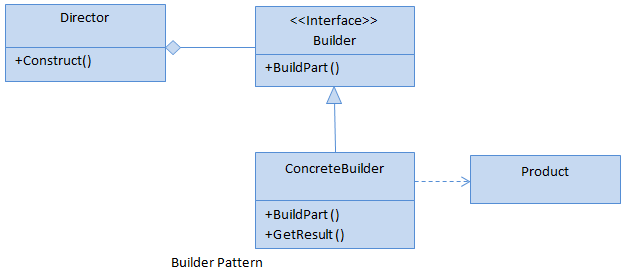

## Builder Pattern

### Builder Pattern là gì?
Builder pattern là một trong những Design Pattern thuộc nhóm Creational Design Pattern 

Mẫu thiết kế này cho phép lập trình viên tạo ra những đối tượng phức tạp chỉ cần thông qua các câu lệnh đơn giản để tác động nên các thuộc tính của nó. Trong bài này chúng ta sẽ tìm hiểu về mẫu thiết kế này 

### Khi nào thì sử dụng Builder Pattern?

Dưới đây là một số trường hợp bạn nên cân nhắc sử dụng builder pattern cho code của mình:

- Các class của bạn chứa quá nhiều hàm khởi tạo hoặc những hàm khởi tạo quá cồng kềnh và phức tạp.

- Bạn không muốn việc gán giá trị cho các tham số của hàm khởi tạo phải tuân theo một trật tự cố định nào đó, ví dụ: Thay vì phải gán giá trị tuần tự từ tham số A rồi mới đến tham số B và tham số C, bạn có thể gán giá trị cho tham số B trước rồi mới đến A và C.ác thuộc tính là độc lập đối với các thuộc tính khác.

### Cách thức triển khai thế nào?

Hình ảnh minh họa về cách triển khai build design pattern



Chúng ta có thể thấy, Builder Pattern sẽ gồm có 4 thành phần chính:

- Product : đại diện cho đối tượng cần tạo, đối tượng này phức tạp, có nhiều thuộc tính.

- Builder : là abstract class hoặc interface khai báo phương thức tạo đối tượng.

- ConcreteBuilder : kế thừa Builder và cài đặt chi tiết cách tạo ra đối tượng. Nó sẽ xác định và nắm giữ các thể hiện mà nó tạo ra, đồng thời nó cũng cung cấp phương thức để trả các các thể hiện mà nó đã tạo ra trước đó.

- Director: là nơi sẽ gọi tới Builder để tạo ra đối tượng.


### Ví dụ
Bây giờ, chúng ta cùng thực hành một ví dụ để hiểu rõ hơn về pattern này

Chúng ta cùng đi đến ví dụ về sản xuất điện thoại di động, ở đây chúng ta muốn sản xuất ra 2 loại điện thoại là : Iphone và Samsung Galaxy. Chúng ta cũng xem xét đặc tính của 2 loại điện thoại này bao gồm:

- Camera
- Dual Sim Slot
- Torch
- Colour Display Screen

OK. Bây giờ chúng ta sẽ sử dụng Builder Design Pattern để giải quyết vấn đề này. Trước hết, chúng ta sẽ định nghĩa một sản phẩm CellPhone bao gồm các thuộc tính gì?

```product.go```

```go
package phone

type CellPhone struct {
    Camera bool
    DualSim bool
    Torch bool
    ColorDisplay bool
}
```

Bên trên chúng ta đã định nghĩa cấu trúc của 1 sản phẩm CellPhone.

```iBuilder.go```

```go
package phone

type BuildProcess interface {
	SetCamera() BuildProcess
	SetDualSim() BuildProcess
	SetTorch() BuildProcess
	SetColorDisplay() BuildProcess
	GetCellPhone() CellPhone
}
``` 

Tiếp theo chúng ta định nghĩa các hành vi có thể có của product trong interface BuildProcess, hay nói các khác là quy trình xây dựng của product

Bây giờ chúng ta sẽ cùng triển khai cho từng loại sản phẩm khác nhau

Đầu tiên là sản phẩm Iphone

```iphone.go```

```go
package phone

type Iphone struct {
  Phone CellPhone
}

func (ip *Iphone) SetCamera() BuildProcess {
	ip.Phone.Camera = false
	return ip
}

func (ip *Iphone) SetDualSim() BuildProcess {
	ip.Phone.DualSim = false
	return ip
}

func (ip *Iphone) SetTorch() BuildProcess {
	ip.Phone.Torch = true
	return ip
}

func (ip *Iphone) SetColorDisplay() BuildProcess {
	ip.Phone.ColorDisplay = false
	return ip
}

func (ip *Iphone) GetCellPhone() CellPhone {
	return ip.Phone
}
```

Các bạn có thể quan sát thấy ở đây chúng ta đã tạo ra một sản phẩm mới là Iphone, nó không chỉ là type của CellPhone mà còn implement các hành vi được định nghĩa trong interface BuildProcess

Tiếp đến là sản phẩm Samsung Galaxy. Chúng ta cũng làm tương tự như với Iphone

```samsung.go```

```go
package phone

type Samsung struct {
	Phone CellPhone
}

func (s *Samsung) SetCamera() BuildProcess {
	s.Phone.Camera = true
	return s
}

func (s *Samsung) SetDualSim() BuildProcess {
	s.Phone.DualSim = true
	return s
}

func (s *Samsung) SetTorch() BuildProcess {
	s.Phone.Torch = false
	return s
}

func (s *Samsung) SetColorDisplay() BuildProcess {
	s.Phone.ColorDisplay = true
	return s
}

func (s *Samsung) GetCellPhone() CellPhone {
	return s.Phone
}
```

```director.go```

```go
package phone

type Director struct {
	builder BuildProcess
}

func (d *Director) SetBuilder(b BuildProcess) {
	d.builder = b
}

func (d *Director) BuildPhone() CellPhone {
	d.builder.SetCamera().SetDualSim().SetTorch().SetColorDisplay()
	return d.builder.GetCellPhone()
}
```

Director mô tả các bước mà chúng ta tạo ra sản phẩm và kết quả của các bước này chính là 1 instance của sản phẩm thực tế

```main.go```

```go
package main

import (
    p "builder-pattern/phone"
)
func main() {
	direc := p.Director{}
	iPhone := &p.Iphone{}
	direc.SetBuilder(iPhone)
	phone := direc.BuildPhone()
	
    fmt.Println("Iphone has camera? ", getAns(phone.Camera))
	fmt.Println("Iphone has Dual Sim? ", getAns(phone.DualSim))
	fmt.Println("Iphone has Torch? ", getAns(phone.Torch))
	fmt.Println("Iphone has Color Display? ", getAns(phone.ColorDisplay))

	samsungPhone := &p.Samsung{}
	direc.SetBuilder(samsungPhone)
	phone = direc.BuildPhone()

    fmt.Println("Samsung Galaxy has camera? ", getAns(phone.Camera))
	fmt.Println("Samsung Galaxy has Dual Sim? ", getAns(phone.DualSim))
	fmt.Println("Samsung Galaxy has Torch? ", getAns(phone.Torch))
	fmt.Println("Samsung Galaxy has Color Display? ", getAns(phone.ColorDisplay))
}

func getAns(b bool) string {
	if b {
		return "YES"
	}
	return "NO"
}
```

Trong file ```main.go``` chúng ta tạo ra một builder object và truyền nó vào director để bắt đầu quá trình sản xuất. Và kết thúc quá trình này chính là sản phẩm mà chúng ta mong muốn

Chạy ```go run main.go``` và kết quả đạt được là:

```
Iphone has camera?  NO
Iphone has Dual Sim?  NO
Iphone has Torch?  YES
Iphone has Color Display?  NO

Samsung Galaxy has camera?  YES
Samsung Galaxy has Dual Sim?  YES
Samsung Galaxy has Torch?  NO
Samsung Galaxy has Color Display?  YES
```
